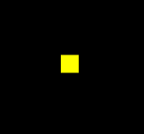
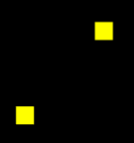

### webgl同步绘制原理

从 day2的webgl同步绘制原理，知道js中，每次异步绘制时，都会清空画布，从新绘制。

而实际应用中，异步的交互是必不可少的，因此，需要考虑异步绘图。

之前绘制点的时候，我们可以记录每一个点，重新绘制，但是当要绘制二维或者3维的其他图形，这个方式就不太合适了

因此，需要新的方式去实现, 下面一个例子将采用到webgl的缓冲区进行异步绘制。

### 通过一个例子讲述

1.先画一个点



2.一秒钟后，在左下角画一个点



3.两秒钟后，我再画一条线段


接下来看一下代码实现：

1.顶点着色器和片元着色器

```html
<!-- 顶点着色器 -->
<script id="vertexShader" type="x-shader/x-vertex">
      attribute vec4 a_Position;
      void main(){
          gl_Position=a_Position;
          gl_PointSize=20.0;
      }
</script>
<!-- 片元着色器 -->
<script id="fragmentShader" type="x-shader/x-fragment">
      void main(){
          gl_FragColor=vec4(1,1,0,1);
      }
</script>
```


2.初始化着色器

```js
import { initShaders } from "../jsm/Utils.js";

const canvas = document.querySelector("#canvas");
canvas.width = window.innerWidth;
canvas.height = window.innerHeight;

// 获取着色器文本
const vsSource = document.querySelector("#vertexShader").innerText;
const fsSource = document.querySelector("#fragmentShader").innerText;

//三维画笔
const gl = canvas.getContext("webgl");

//初始化着色器
initShaders(gl, vsSource, fsSource);
```

3.建立缓冲对象，并将其绑定到webgl 上下文对象上，然后向其中写入顶点数据。将缓冲对象交给attribute变量，并开启attribute 变量的批处理功能。

```js
//顶点数据
let points=[0, 0.2]
//缓冲对象
const vertexBuffer = gl.createBuffer();
//绑定缓冲对象
gl.bindBuffer(gl.ARRAY_BUFFER, vertexBuffer);
//写入数据
gl.bufferData(gl.ARRAY_BUFFER,new Float32Array(points),gl.STATIC_DRAW)
//获取attribute 变量
const a_Position=gl.getAttribLocation(gl.program, 'a_Position')
//修改attribute 变量
gl.vertexAttribPointer(a_Position, 2, gl.FLOAT, false, 0, 0)
//赋能-批处理
gl.enableVertexAttribArray(a_Position)
```


4.刷底色并绘制顶点

```js
//声明颜色 rgba
gl.clearColor(0, 0, 0, 1);
//刷底色
gl.clear(gl.COLOR_BUFFER_BIT);
//绘制顶点
gl.drawArrays(gl.POINTS, 0, 1);
```


5.一秒钟后，向顶点数据中再添加的一个顶点，修改缓冲区数据，然后清理画布，绘制顶点

```js
setTimeout(()=>{
  points.push(-0.2,-0.1)
  gl.bufferData(gl.ARRAY_BUFFER,new Float32Array(points),gl.STATIC_DRAW)
  gl.clear(gl.COLOR_BUFFER_BIT);
  gl.drawArrays(gl.POINTS, 0, 2);
},1000)
```


6.两秒钟后，清理画布，绘制顶点，绘制线条

```js
setTimeout(()=>{
    gl.clear(gl.COLOR_BUFFER_BIT);
    gl.drawArrays(gl.POINTS, 0, 2);
    gl.drawArrays(gl.LINE_STRIP, 0, 2);
},2000)
```


总结一下上面的原理： 当缓冲区被绑定在了webgl 上下文对象上后，我们在异步方法里直接对其进行修改即可，顶点着色器在绘图的时候会自动从其中调用数据。

WebGLBuffer缓冲区中的数据在异步方法里不会被重新置空。

理解了异步绘图原理后，我们还可以对这种图形的绘制进行一个简单的封装。