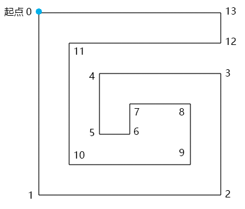
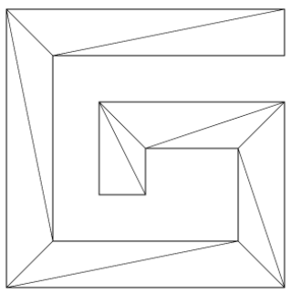
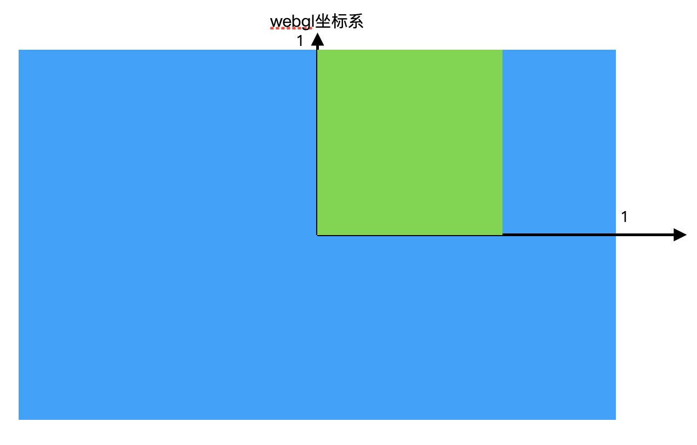

### 图形转面
图形转面是将一个图形分解成为多个面，而在webgl中自然是分解成三角面了

#### 图形转面的基本步骤

在three.js 里有一个图形几何体[ShapeGeometry](https://threejs.org/docs/index.html#api/en/geometries/ShapeGeometry)，可以把图形变成面。


我们学到这里，只要有数学支撑，也可以实现这种效果。

接下来我要使用TRIANGLES 独立三角形的方式，将图形转成面。

我使用的方法叫做“砍角”，其原理就是从起点将多边形中符合特定条件的角逐个砍掉，然后保存到一个集合里，直到把多边形砍得只剩下一个三角形为止。这时候集合里的所有三角形就是我们想要的独立三角形。

举个例子:



已知：逆时针绘图的路径G

求：将其变成下方网格的方法



解：

1.寻找满足以下条件的▲ABC：

- ▲ABC的顶点索引位置连续，如012,123、234
- 点C在向量AB的正开半平面里，可以理解为你站在A点，面朝B点，点C要在你的左手边（数学上其实就是个点在向量的哪一边）
- ▲ABC中没有包含路径G 中的其它顶点

2.当找到▲ABC 后，就将点B从路径的顶点集合中删掉，然后继续往后找。

3.当路径的定点集合只剩下3个点时，就结束。

4.由所有满足条件的▲ABC构成的集合就是我们要求的独立三角形集合。

#### 绘制路径G

下面将使用上面例子做进行代码的实际操作

1.路径G的顶点数据(就是上面图的css坐标)

```js
const pathData = [0, 0, 600, 0, 600, 100, 100, 100, 100, 500, 500, 500, 500, 300, 300, 300, 300, 400, 200, 400, 200, 200, 600, 200, 600, 600, 0, 600];
```


在pathData里两个数字为一组，分别代表顶点的ｘ位和ｙ位。

pathData里的数据是我以像素为单位画出来的，在实际项目协作中，UI给我们的svg文件可能也是以像素为单位画出来的，这个我们要做好心理准备。

因为，webgl画布的宽和高永远都是两个单位。

所以，我们要将上面的点画到webgl 画布中，就需要做一个数据映射(其实就是归一化)。


2.在webgl 中绘制正方形。

从pathData 数据中我们可以看出，路径G的宽高都是600，是一个正方形。

所以，我可以将路径G映射到webgl 画布的一个正方形中。

这个正方形的高度我可以暂且定为1，那么其宽度就应该是高度除以canvas画布的宽高比。

这时候，回顾一下webgl坐标系，有助于理解上面的描述。



下面通过代码描述

```js
//宽高比
const ratio = canvas.width / canvas.height;
//正方形高度
const rectH = 1.0;
//正方形宽度
const rectW = rectH / ratio;
```


3.正方形的定位，把正方形放在webgl画布的中心。

获取正方形尺寸的一半，然后求出其x、y方向的两个极值即可。

```js
//正方形宽高的一半
const [halfRectW, halfRectH] = [rectW / 2, rectH / 2];
//两个极点
const minX = -halfRectW;
const minY = -halfRectH;
const maxX = halfRectW;
const maxY = halfRectH;
```

4.利用之前的Poly对象绘制正方形，测试一下效果。

```js
const rect = new Poly({
    gl,
    vertices: [
        minX, maxY,
        minX, minY,
        maxX, minY, 
        maxX, maxY,
    ],
});
rect.draw();
```

5.建立x轴和y轴比例尺。

绘制正方形是目前只得到四个顶点的坐标值，但是其他的坐标值也是需要进行转换。

而转化的点也必然在这个矩形区域内，这个时候就很好转化了。

比如，两根长短不一的直线 l1和l2, l1 = k * l2

将线换成平行与x轴的坐标代替
(l1XMax - l1XMin) = k * (l2XMax - l2XMax)

这样，不考虑y轴的情况， 只要知道l1对应的一个点，那么一定会得到l2的一个点

Y轴方向一样。

下面通过代码实现

```js
const scaleX = ScaleLinear(0, minX, 600, maxX);
const scaleY = ScaleLinear(0, minY, 600, maxY);
function ScaleLinear(ax, ay, bx, by) {
  const delta = {
    x: bx - ax,
    y: by - ay,
  };
  const k = delta.y / delta.x;
  const b = ay - ax * k;
  return function (x) {
    return k * x + b;
  };
}
```

ScaleLinear(ax, ay, bx, by) 方法使用的就是点斜式，用于将x轴和y轴上的数据像素数据映射成 webgl数据

- ax 像素数据的极小值
- ay webgl数据的极小值
- bx 像素数据的极大值
- by webgl数据的极大值


6.将路径G中的像素数据解析为webgl 数据

```js
const glData = [];
for (let i = 0; i < pathData.length; i += 2) {
    glData.push(scaleX(pathData[i]), scaleY(pathData[i + 1]));
}
```

画一下看看：

```js
const path = new Poly({
    gl,
    vertices: glData,
    types: ["POINTS", "LINE_LOOP"],
});
path.draw();
```

做到这已经将css数据成功映射为webgl坐标，并绘制出来

下面开始基于图形转面的逻辑进行实际操作

### 将图形网格化

1.建立了一个ShapeGeo 对象，用于将图形网格化。

```js
const shapeGeo = new ShapeGeo(glData)
```

属性：

- pathData 平展开的路径数据
- geoData 由路径数据pathData 转成的对象型数组
- triangles 三角形集合，对象型数组
- vertices 平展开的对立三角形顶点集合

方法：

- update() 更新方法，基于pathData 生成vertices
- parsePath() 基于路径数据pathData 转成对象型数组
- findTriangle(i) 寻找符合条件的三角形
  - i 顶点在geoData 中的索引位置，表示从哪里开始寻找三角形

- includePoint(triangle) 判断三角形中是否有其它顶点
- inTriangle(p0, triangle) 判断一个顶点是否在三角形中
- cross([p0, p1, p2]) 以p0为基点，对二维向量p0p1、p0p2做叉乘运算(判断p0在p1->p2的哪一侧)
- upadateVertices() 基于对象数组geoData 生成平展开的vertices 数据


2.绘制G形面

```js
const face = new Poly({
    gl,
    vertices: shapeGeo.vertices,
    types: ["TRIANGLES"],
});
face.draw();
```