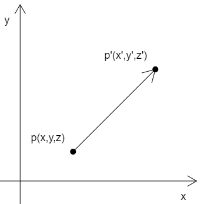

### 平移

对图形的平移就是对图形所有顶点的平移。



已知：

- 顶点 p(x,y,z)
- 在 x、y、z 三个方向上，分别将点 p 移动 tx、ty、tz

求：点 p 移动后的位置 p'(x',y',z')

解：

```
x'=x+tx
y'=y+ty
z'=z+tz
```

### 向量加法

在实际代码中，我们要有一个向量的概念。

比如 (x,y,z) ，我们既可以说它是一个顶点位置，也可以说它是一个向量。

至于 (x,y,z) 到底是什么，要看我们拿它做什么。

比如，把点 p(x,y,z) 作为点位时，那它就是点 p(x,y,z)

我们把 p 的移动距离 tx、ty、tz 封装成一个对象 pt(tx,ty,tz)，那么 pt 就是一个向量，一个为点 p 指明移动方向和距离的向量。

因此：点 p 的移动结果 p' 就可以这么写：

```
p'=p+pt
```

由上可知，顶点的位移就是向量的加法。

### 代码实现

#### GLSL ES 语言里的向量运算

在 GLSL ES 语言里，是可以直接进行向量运算。

下面的顶点着色器里的代码：

```js
attribute vec4 a_Position;
vec4 translation=vec4(0,0.2,0,0);
void main(){
    gl_Position = a_Position+translation;
}
```

- a_Position 是原始点位，属于 attribute 变量
- translation 是顶点着色器里的私有变量，没有向外部暴露，属于 4 维向量
- a_Position+translation 便是着色器内的向量加法，这里是对原始点位进行位移

之后，我们也可以把 translation 变量暴露出去，让 js 可以修改图形位置：
