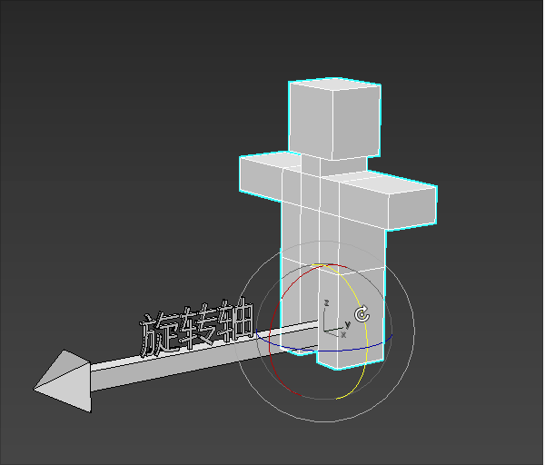
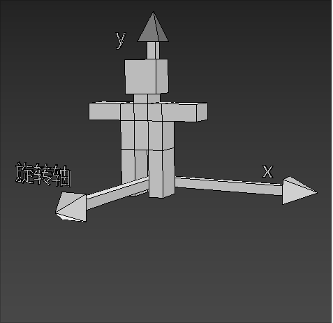

### 旋转的概念

三维物体的旋转要比位移复杂一点，因为三维物体的旋转需要知道以下条件：

- 旋转轴
- 旋转方向
- 旋转角度

我们可以想象一个场景：

一个小人站在旋转轴的起点进行旋转。

小人要往左转还是往右转，就是旋转的方向。

小人旋转的大小就是旋转角度。



### 旋转方向的正负

物体的旋转方向是有正负之分的。

那何时为正，何时为负呢？

在 webgl 中，除裁剪空间之外的大部分功能都使用了右手坐标系。

所以，在我们初学 webgl 的时候，可以暂且将其当成右手坐标系，等讲到裁剪空间的时候，我再跟大家说左手坐标系。

右手坐标系中：

- 当物体绕 z 轴，从 x 轴正半轴向 y 轴正半轴逆时针旋转时，是正向旋转，反之为负。
- 当物体绕 x 轴，从 y 轴正半轴向 z 轴正半轴逆时针旋转时，是正向旋转，反之为负。
- 当物体绕 y 轴，从 z 轴正半轴向 x 轴正半轴逆时针旋转时，是正向旋转，反之为负。

例子， 绕 z 轴转的正向旋转



### 旋转公式

先举一个让顶点围绕 z 轴旋转的例子。


已知：

- 点 A 的位置是(ax,ay,az)
- 点 A 要围绕 z 轴旋转 β 度，转到点 B 的位置

求：点 A 旋转后的 bx、by 位置

解：

我们由结果逆推一下解题思路。

因为 ∠β 是已知的，∠α 可以通过点 A 得出。

所以我们可以得出：

```js
∠xOB=α+β
```

那我们通过三角函数就可以推出 bx、by

设 ∠xOB=θ，则：

```js
bx=cosθ*|OA|
by=sinθ*|OA|
```

上面的|OA|是点 O 到点 A 的距离，可以直接用点 A 求出：

```js
|OA|=Math.sqrt(ax*ax+ay*ay
```

那我们接下来只需要知道 cosθ 和 sinθ 的值即可

因为：θ=α+β

所以，我们可以利用和角公式求 cosθ 和 sinθ 的值：

```js
cosθ = cos(α + β);
cosθ = cosα * cosβ - sinα * sinβ;
```

```js
sinθ = sin(α + β);
sinθ = cosβ * sinα + sinβ * cosα;
```

所以：

```js
bx=cosθ*|OA|
bx=(cosα*cosβ-sinα*sinβ)*|OA|
bx=cosα*cosβ*|OA|-sinα*sinβ*|OA|
```

```js
by=sinθ*|OA|
by=(cosβ*sinα+sinβ*cosα)*|OA|
by=cosβ*sinα*|OA|+sinβ*cosα*|OA|
```

因为：

```js
cosα*|OA|=ax
sinα*|OA|=ay
```

所以我们可以简化 bx、by 的公式

```js
bx = ax * cosβ - ay * sinβ;
by = ay * cosβ + ax * sinβ;
```

上面的 bx、by 就是我们要求的答案。

那接下来咱们可以测试一下，如何让一个三角形绕 z 轴转起来

### 在着色器中书写旋转

我们可以直接在着色器里写旋转公式：

```js

```
