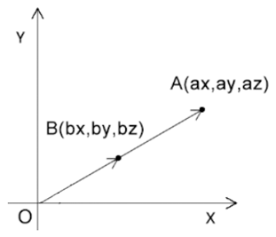

### 缩放的概念

缩放可以理解为对向量长度的改变，或者对向量坐标分量的同步缩放



已知：

- 点 A 的位置是(ax,ay,az)
- 点 A 基于原点內缩了一半

求：点 A 內缩了一半后的 bx、by、bz 位置

解：

```js
bx = ax * 0.5;
by = ay * 0.5;
bz = az * 0.5;
```

注意， 注意注意， 缩放是基于原点进行的缩放，因此会产生一定的位移

### 在着色器中缩放

我可以对 gl_Position 的 x、y、z 依次缩放。

```html
<script id="vertexShader" type="x-shader/x-vertex">
  attribute vec4 a_Position;
  float scale=1.2;
  void main(){
  	gl_Position.x= a_Position.x*scale;
  	gl_Position.y= a_Position.y*scale;
  	gl_Position.z= a_Position.z*scale;
  	gl_Position.w=1.0;
  }
</script>
```

也可以从 a_Position 中抽离出由 x、y、z 组成的三维向量，对其进行一次性缩放。

```html
<script id="vertexShader" type="x-shader/x-vertex">
  attribute vec4 a_Position;
  float scale=1.2;
  void main(){
  	gl_Position=vec4(vec3(a_Position)*scale,1.0);
  }
</script>
```

### 用 js 缩放图形

同样的我们也可以把缩放系数暴露给 js，通过 js 缩放图形。

1.建立 uniform 变量

```html
<script id="vertexShader" type="x-shader/x-vertex">
  attribute vec4 a_Position;
  uniform float u_Scale;
  void main(){
      gl_Position=vec4(vec3(a_Position)*u_Scale,1.0);
  }
</script>
```

2.使用 js 获取并修改 uniform 变量

```js
const u_Scale = gl.getUniformLocation(gl.program, "u_Scale");
gl.uniform1f(u_Scale, 1.0);
```

3.继续来点动画

```js
let angle = 0;
!(function ani() {
  angle += 0.05;
  const scale = Math.sin(n) + 1;
  gl.uniform1f(u_Scale, scale);
  gl.clear(gl.COLOR_BUFFER_BIT);
  gl.drawArrays(gl.TRIANGLES, 0, 3);
  requestAnimationFrame(ani);
})();
```
