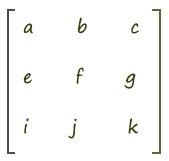
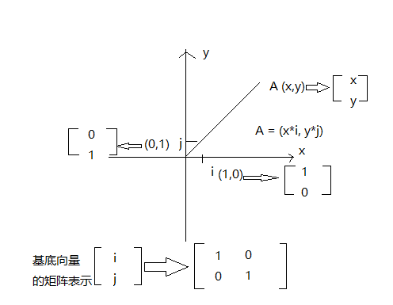

### 矩阵

矩阵（Matrix）是一个按照矩形纵横排列的复数集合。

矩阵就像一个矩形的阵盘，通过其中纵横排列的元素，我们可以摆出不同功能的阵法，比如位移矩阵、旋转矩阵、缩放矩阵……

在矩阵中的每一行，或者每一列数字构成的集合，可以视之为向量。

### 向量

向量，又叫矢量，它是一个用于表示方向和量的对象。

#### 坐标、向量与矩阵

下面通过二维空间描述坐标、向量与矩阵的表示关系

任何一个坐标系都可以定义一个单位为 1 的基底坐标(i,j), 那么 点 i（1，0）， 点 j（0，1）

在 webgl 里，矩阵元素的排列规则是列主序， 因此， oi 分量， oj 分量，基底向量以及 oA 四个向量的矩阵表示如图。

那么当我们要进行变换时，其实就是基于基底分量坐标的变换

拿旋转来说，比如：旋转 90 度
