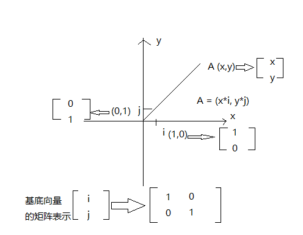
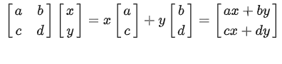
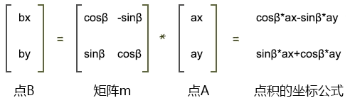

### 矩阵

矩阵（Matrix）是一个按照矩形纵横排列的复数集合。


矩阵就像一个矩形的阵盘，通过其中纵横排列的元素，我们可以摆出不同功能的阵法，比如位移矩阵、旋转矩阵、缩放矩阵……

在矩阵中的每一行，或者每一列数字构成的集合，可以视之为向量。

### 向量

向量，又叫矢量，它是一个用于表示方向和量的对象。

#### 坐标、向量与矩阵

下面通过二维空间描述坐标、向量与矩阵的表示关系



任何一个坐标系都可以定义一个单位为 1 的基底坐标(i,j), 那么 点 i（1，0）， 点 j（0，1）

基向量 i，基向量 j，基底合向量以及 oA 四个向量的矩阵表示如上图。

当我们要进行变换时，其实是基于基底分量坐标的变换

拿旋转来说，比如：逆时针旋转 90 度， 由于 向量 A=(x*i, y*j), 所以相当于基底坐标旋转了 90 度


而从计算的角度看，因为二维矩阵变换相当于先变换基向量 i，再变换基向量 j，所以矩阵与向量乘法可以表示为下图(其实也是向量相乘法则：矩阵 A 的行乘以矩阵 B 的列), 其中 i(a,c), j(b, d) 组成基底向量的矩阵(a, b, c,d)。这是旋转成 90 度的案例，那么要旋转任意角度 这个矩阵应该怎么变化呢？其实就是三角函数变换，下面会说到



注意：

- 横着的两组向量是：向量(a,b)、向量(c,d)
- 竖着的两组向量是：向量(a,c)、向量(b,d)

用专业术语来说：

- 横着的两组遵循的规则是行主序，即将矩阵中的一行数据视之为一个向量。
- 竖着的两组遵循的规则是列主序，即将矩阵中的一列数据视之为一个向量。

至于我们是使用行主序，还是列主序，这就得看规则的定制者了。

在 webgl 里，矩阵元素的排列规则是列主序。

矩阵和向量相乘的规则就是让矩阵中的每个向量和向量 v(x,y) 相乘。

向量和向量相乘，就是在求向量的点积，其结果是一个实数，而不再是向量。

比如上图中，向量(a,b)乘以向量 v(x,y)的结果是：

```js
a * x + b * y;
```

而向量(c,d) 乘以向量 v(x, y)的结果是

```js
c * x + d * y;
```

上图中，矩阵【a,b,c,d】乘以向量(x,y) 会得到两个结果，即 ax+by 和 cx+dy。

这两个结果会构成一个新的向量 v'(x',y')

```
x'=a*x+b*y
y'=c*x+d*y
```

这时我们可以将其和数学里的旋转公式做一下比较。


点 A(ax,ay)围绕 z 轴旋 β 度,其旋转后的位置是点 B(bx,by)，则：

```js
bx = cosβ * ax - sinβ * ay;
by = sinβ * ax + cosβ * ay;
```

对比上面的两组公式，试想一下：

向量 v 是不是可以当成一个点位呢？

答案是可以的。

那我现在就让向量 v 代表的位置，就是点 A 的位置。

那么矩阵 m 乘以向量 v，是不是可以让向量 v 代表的这个点位旋转 β 度呢？

如果可以，那么矩阵里的元素应该满足什么条件呢？

满足以下条件即可：

```js
a = cosβ;
b = -sinβ;
c = sinβ;
d = cosβ;
```

这样，用矩阵乘以向量的方法得到的旋转结果和用数学公式得到的结果就是一样的，即;

```js
a*x+b*y=cosβ*ax-sinβ*ay
c*x+d*y=sinβ*ax+cosβ*ay
```

最终我们就可以用矩阵乘以向量的方式让任意点 p 旋转 β 度



### 在着色器中写矩阵

我们是可以直接在着色器中建立矩阵对象的。

```html
<script id="vertexShader" type="x-shader/x-vertex">
  attribute vec4 a_Position;
  float angle=radians(40.0);
  float sinB=sin(angle);
  float cosB=cos(angle);
  mat2 m2=mat2(
    cosB, sinB,
    -sinB,cosB
  );
  void main(){
    gl_Position = vec4(
      m2*vec2(a_Position),
      a_Position.z,a_Position.w
    );
  }
</script>
```

- mat2 是二维矩阵对象(注意参数，在 webgl 中是以列主序编排的， 即：cosB, sinB 是第一列， -sinB, cosB 是第二列)

### 用 js 建立矩阵对象并传递给着色器

1.在顶点着色器中建立 uniform 变量

```html
<script id="vertexShader" type="x-shader/x-vertex">
  attribute vec4 a_Position;
  uniform mat2 u_Matrix;
  void main(){
    gl_Position = vec4(
      u_Matrix*vec2(a_Position),
      a_Position.z,a_Position.w
    );
  }
</script>
```

2.获取并修改 uniform 变量

```js
const u_Matrix = gl.getUniformLocation(gl.program, "u_Matrix");
let angle = 0.2;
const [sinB, cosB] = [Math.sin(angle), Math.cos(angle)];
// 列主序编排
const matrix = [
  cosB,
  sinB, // 以上数据为第一列
  -sinB,
  cosB, // 以上至第一列末的数据为第二列
];
gl.uniformMatrix2fv(u_Matrix, false, matrix);
```

3.后面我们也可以在其中添加动画

```js
const u_Matrix = gl.getUniformLocation(gl.program, "u_Matrix");
let angle = 0.2;

!(function ani() {
  angle += 0.02;
  const [sinB, cosB] = [Math.sin(angle), Math.cos(angle)];
  const matrix = [cosB, sinB, -sinB, cosB];
  gl.uniformMatrix2fv(u_Matrix, false, matrix);

  gl.clear(gl.COLOR_BUFFER_BIT);
  gl.drawArrays(gl.TRIANGLES, 0, 3);
  requestAnimationFrame(ani);
})();
```

### 平移

按照上面逆推的思维， 推出平移的矩阵


####

```jS
<script id="vertexShader" type="x-shader/x-vertex">
    attribute vec4 a_Position;
    float tx=0.4;
    float ty=0.3;
    //列主序
    // 第一列： 1.0， 0.0，0.0
    // 第二列： 0.0， 1.0，0.0
    // 第三列： tx， ty，1.0
    mat4 m4=mat4(
      1.0, 0.0, 0.0,
      0.0, 1.0, 0.0,
      tx,  ty,  1.0
    );
    void main(){
      gl_Position = m4*a_Position;
    }
  </script>
```

### 缩放矩阵

同理可以推理出缩放得矩阵

下面得是思维得矩阵，但是原理是一样得

顶点着色可以这样写：

```html
<script id="vertexShader" type="x-shader/x-vertex">
  attribute vec4 a_Position;
  //列主序
  mat4 m4=mat4(
    2.0, 0.0, 0.0,0.0,
    0.0, 3.0, 0.0,0.0,
    0.0, 0.0, 4.0,0.0,
    0.0, 0.0, 0.0,1.0
  );
  void main(){
    gl_Position = m4*a_Position;
  }
</script>
```

### 矩阵库

像我们之前那样手写矩阵，其实是很麻烦的，我们可以将其模块化。

现在市面上已经有许多开源的矩阵库了，比如《WebGL 编程指南》里的 cuon-matrix.js，three.js 的 Matrix3 和 Matrix4 对象。

接下我们就简单说一下 three.js 的 Matrix4 对象的用法。

1.引入 Matrix4 对象

```js
import { Matrix4 } from "https://unpkg.com/three/build/three.module.js";
```

2.实例化矩阵对象，在其中写入旋转信息

```js
const matrix = new Matrix4();
matrix.makeRotationZ(Math.PI / 6);
```

3.基于 matrix 对象的 elements 属性，修改 uniform 变量

```js
const u_Matrix = gl.getUniformLocation(gl.program, "u_Matrix");
gl.uniformMatrix4fv(u_Matrix, false, matrix.elements);
```
