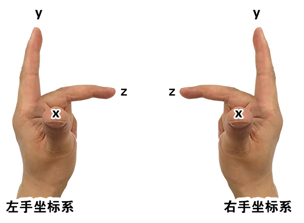

## 视图矩阵

### 视图矩阵的概念

视图矩阵（View Matrix）是计算机图形学和计算机视觉中的一个转换矩阵，用于将 3D 场景转换为 2D 图像。有时也称为相机矩阵（Camera Matrix）。视图矩阵是 3D 渲染中常用的矩阵之一，用于将场景中的物体从世界坐标系转换到相机坐标系（也称作观察坐标系）。视图矩阵将世界坐标系中的物体的位置和方向转换到与相机位置和方向一致的坐标系中，从而让相机可以视角正确地观察场景中的物体。视图矩阵的构造原理相对简单，首先需要确定相机的位置、方向和上方向（通常情况下，上方向默认为 Y 轴正方向）。然后，通过将相机的位置和方向作为坐标系的原点和 Z 轴方向，构造出一个与相机坐标系一致的坐标系。最后，通过矩阵的变换将物体从世界坐标系变换到相机坐标系下。

一般情况下，视图矩阵的计算可以通过各种数学库（如 OpenGL、D3D 等）提供的函数来完成。在实现过程中，我们只需要提供相机的位置、目标点和上向量（或欧拉角、四元数），然后通过矩阵变换的方式即可完成视图矩阵的计算。

直观解析： 视图矩阵可以让我们从我们所想要的角度观察物体。我们在裁剪空间(webgl 画布)中绘图的时候，z 轴数据是没有效果的，因为裁剪空间的 z 轴和 canvas 画布垂直，我们看不到顶点的深度差异。因此，我们若想看到立体效果，从另一个角度来观察物体。这个时候就需要视图矩阵了，视图矩阵可以为顶点提供一套新的坐标基底，并获取顶点在这套坐标基底中的点位，然后再将其显示在裁剪空间中。

#### 如何从另外一个角度观察物体

在高中数学里有一块空间向量的知识，叫做"空间向量分解定理"：

如果三个向量 a、b、c 不共面，那么对空间任一向量 p，存在一个唯一有序实数组(x,y,z)，使

```js
p = xa + yb + zc;
```

- a,b,c 可以视之为一个三维空间的坐标基底，高中数学里称其为基向量，可构成一个矩阵，一阵便可自成一界。
- x,y,z 可视之为顶点的原始点位。
- 点 p 可理解为顶点的原始点位(x,y,z) 在矩阵[a,b,c]所架构出的新世界的中的点位。

由上式可知，只要我们知道了向量 a、b、c，便可以从一个新的世界，新的视角来欣赏立体的事物。

若你只是想换一个角度观察裁剪空间中的物体，那么基向量还要满足以下条件：

- 基向量需要相互垂直。因为裁剪空间的坐标系是三维直角坐标系。
- 基向量的单位必须是 1，也就是向量 a、b、c 要做归一化，使其长度为 1。因为裁剪空间里三个轴的单位就是 1。

`满足了上面的条件后，由矩阵[a,b,c]所架构出的新世界和裁剪空间就只会有旋转方向上的差异，这样新世界里的顶点也可以以另一个角度显示在裁剪空间里`。

接下来的重点就是如何定义坐标基底 a,b,c

在实际开发中，a,b,c 不适合凭空想象，我们需要更具象、更通俗易懂的参数来计算 a,b,c

就目前我已知的矩阵库中，都是通过三个参数计算 a,b,c：

- 视点 e
- 目标点 t
- 上方向 u

这三个参数是什么概念呢？

以我的脑袋为例，我脑袋的上下方向是 y 轴，左右方向是 x 轴，前后方向时 z 轴。

视点是我的眼睛位置，目标点是我的眼睛看的地方。视点和目标点可以决定我的脑袋绕 y 轴左右旋转的角度，以及 x 轴上的俯视、仰视。

大家可以自己转转脑袋，想象一下。

接下来，咱们再说一下如何通过视点、目标点、上方向来得到基向量。

### 视图矩阵的布阵思路

1.以视点 e 为终点，目标点 t 为起点，计算向量 d(dx,dy,dz)

```js
d = e - t;
```

注：向量 d 和视点看向目标的方向正好相反。

2.将 d 归一化

```js
d*=1/|d|
```

简单说一下归一化思路。

因为：归一化后的向量的长度为 1

所以，我们可以找到向量归一后的长度和向量归一前的长度的比值：

```js
1/|d|
```

因为：向量的归一化只是改变了向量的长度，未改变向量的方向

所以：归一前的向量和归一后的向量共线且同向

所以：

```js
dx*=1/|d|
dy*=1/|d|
dz*=1/|d|
```

简写一下就是之前的归一公式：

```js
d*=1/|d|
```

3.求向量 d 和上方向的垂线 a(ax,ay,az)

```js
a = d ^ u;
```

这里我使用的是空间向量的叉乘。

空间向量的叉乘，是向量运算中的一种重要方式。

两个三维向量的叉乘将产生一个新的向量，它垂直于原始向量并满足右手定则。

它的值的大小等于原始向量两点之间的平行四边形的面积，方向由右手定则规定。

其在右手规则下的坐标运算如下:

已知：向量 a(ax,ay,az)，向量 b(bx,by,bz)

求：a^b 的结果 c(cx,cy,cz)

解：

```js
cx = ay * bz - az * by;
cy = az * bx - ax * bz;
cz = ax * by - ay * bx;
```

4.将向量 a 归一化

```js
a*=1/|a|
```

5.求向量 d 和向量 a 的垂线 b(bx,by,bz)

```js
b = d ^ a;
```

6.将向量 d 取反，得向量 c(cx,cy,cz)

```js
c = -d;
```

上面的方法是为了将新世界的坐标系变成左手坐标系。

基向量 a,b,c 分别对应着左手坐标系里的 x,y,z。

在新世界的左手坐标系里，物体的 z 值越小，视点所看见的就越大。

裁剪空间里的 z 就是下图右手坐标系里的 z。



到目前为止我们已经得到了基向量 a,b,c，接下来就可以布阵了。

7.写一个列主序的视图矩阵 matrix

```js
matrix = [ax, bx, cx, 0, ay, by, cy, 0, az, bz, cz, 0, 0, 0, 0, 1];
```

接下来将 matrix 传递给顶点着色器，让其和裁剪空间里的原始点位相乘，便可以从一个新的视角看见裁剪空间里的物体了。

思路已通，接下来我们在代码里手写一个。
