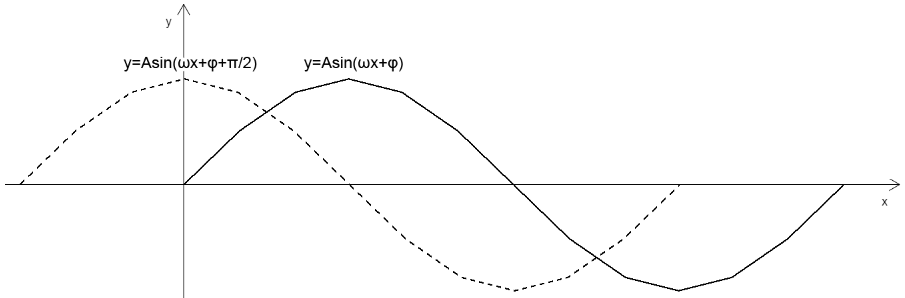

## 在视图矩阵中释放三角函数的美丽

在视图矩阵中，我们可以将算法和艺术相融合，让它充满乐趣。

就像下面的顶点，就是我通过三角函数来实现的。

风乍起，吹皱一池春水。


接下来，咱们就说一下正弦型函数 。

1.正弦型函数公式

y=Asin(ωx+φ)

2.正弦型函数概念分析


已知：

- 圆 O 半径为 A
- 点 P1 在圆 O 上
- ∠xOP1=φ
- 点 P1 围绕 z 轴旋转 t 秒后，旋转到点 P2 的位置
- 点 P1 的旋转速度为 ω/秒

可得：

- 点 P1 旋转的量就是 ω\*t
- 点 P2 基于 x 正半轴的弧度就是 ∠xOP2=ω\*t+φ

- 点 P1 的转动周期 T=周长/速度=2π/ω
- 点 P1 转动的频率 f=1/T=ω/2π

  3.正弦型函数的图像性质 y=Asin(ωx+φ)

- A 影响的是正弦曲线的波动幅度


- φ 影响的是正弦曲线的平移



- ω 影响的是正弦曲线的周期，ω 越大，周期越小


通过 A、ω、φ 我们可以实现正弦曲线的波浪衰减。


### 2-代码实现

#### 2-1-布点

1.准备好顶点着色器

```html
<script id="vertexShader" type="x-shader/x-vertex">
  attribute vec4 a_Position;
  uniform mat4 u_ViewMatrix;
  void main(){
    gl_Position = u_ViewMatrix*a_Position;
    gl_PointSize=3.0;
  }
</script>
```
