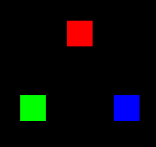

### 多 attribute 变量的概念

接下来我们先通过一个问题来引出多 attribute 变量的概念和作用。

问题：如何一次性绘制三个不同颜色的点。

我们之前说“js 与着色器间的数据传输”的时候，说过 js 修改顶点颜色：

- 片元着色器

```html
<script id="fragmentShader" type="x-shader/x-fragment">
  precision mediump float;
  uniform vec4 u_FragColor;
  void main(){
      gl_FragColor=u_FragColor;
  }
</script>
```

- js

```js
const u_FragColor = gl.getUniformLocation(gl.program, "u_FragColor");
gl.uniform4f(u_FragColor, 1, 0, 1, 1);
```

这种方式只会绘制三个同样颜色的点。

那我们若想给这三个点不同的颜色，就需要再建立一个接收颜色数据的 attribute 变量。

### 代码实现

1.在顶点着色器中，建立一个名为 a_Color 的 attribute 变量，并通过 varying 变量将其全局化，之后可以在片着色器中拿到。

```html
<script id="vertexShader" type="x-shader/x-vertex">
  attribute vec4 a_Position;
  attribute vec4 a_Color;
  varying vec4 v_Color;
  void main(){
      gl_Position=a_Position;
      gl_PointSize=50.0;
      v_Color=a_Color;
  }
</script>
```

2.在片元着色器中获取顶点着色器中全局化的 varying 变量，然后将其作为片元颜色。

```html
<script id="fragmentShader" type="x-shader/x-fragment">
  precision mediump float;
  varying vec4 v_Color;
  void main(){
      gl_FragColor=v_Color;
  }
</script>
```

3.在 js 中，将顶点数据批量传递给顶点着色器。

```js
//顶点数据
const vertices = new Float32Array([0, 0.2, 0, -0.2, -0.1, 0, 0.2, -0.1, 0]);
//缓冲对象
const vertexBuffer = gl.createBuffer();
//绑定缓冲对象
gl.bindBuffer(gl.ARRAY_BUFFER, vertexBuffer);
//写入数据
gl.bufferData(gl.ARRAY_BUFFER, vertices, gl.STATIC_DRAW);
//获取attribute 变量
const a_Position = gl.getAttribLocation(gl.program, "a_Position");
//修改attribute 变量
gl.vertexAttribPointer(a_Position, 3, gl.FLOAT, false, 0, 0);
//赋能-批处理
gl.enableVertexAttribArray(a_Position);
```

我们之前多点绘制里说过相关知识，我就不再多说了。

4.用同样原理将颜色数据批量传递给顶点着色器。

```js
//颜色数据
const colors = new Float32Array([1, 0, 0, 0, 1, 0, 0, 0, 1]);
//缓冲对象
const colorBuffer = gl.createBuffer();
//绑定缓冲对象
gl.bindBuffer(gl.ARRAY_BUFFER, colorBuffer);
//写入数据
gl.bufferData(gl.ARRAY_BUFFER, colors, gl.STATIC_DRAW);
//获取attribute 变量
const a_Color = gl.getAttribLocation(gl.program, "a_Color");
//修改attribute 变量
gl.vertexAttribPointer(a_Color, 3, gl.FLOAT, false, 0, 0);
//赋能-批处理
gl.enableVertexAttribArray(a_Color);
```

5.绘制顶点

```js
//刷底色
gl.clear(gl.COLOR_BUFFER_BIT);
//绘制顶点
gl.drawArrays(gl.POINTS, 0, 3);
```

效果如下：



在上面的案例里，我们用 js 建立了两份 attribute 数据，一份是顶点位置数据，一份是顶点颜色数据。

然后我们将两份 attribute 数据放进了了两个缓冲区对象里，后面绘图的时候，顶点着色器就会从这里面找数据。

其实，我们也可以把数据合一下，把点位数据和颜色数据放进一个集合里，然后让 attribute 变量按照某种规律从其中寻找数据。
