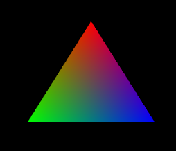
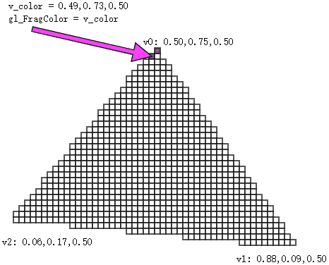
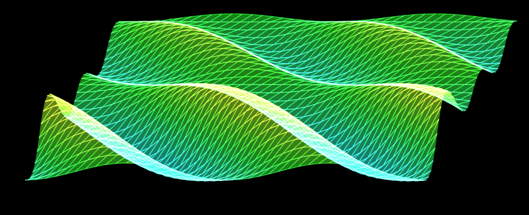

### 1-绘制彩色三角形

我们可以用独立三角形绘图。

```js
gl.drawArrays(gl.TRIANGLES, 0, sourseSize);
```

效果如下：



为什么会画出一个具有三种颜色的三角形呢？

这是因为我给三角形的三个顶点绑定了三种颜色。

那为什么这三种颜色可以平滑过渡呢？这其中的规律是什么？

我们通过下面这个图便可以很好的去理解，它就是在三个点之间做线性补间，将补间得出的颜色填充到三角形所围成的每个片元之中。



我们在知道了多点异色，以及片元着色的原理后，就可以尝试做一点好玩的东西，比如画一片春色：



在画之前，我们需要先做一下代码架构。
