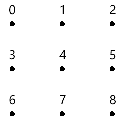
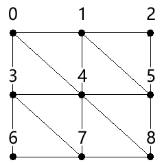

### 一片春色

在连点成面的时候，我们首先要有一个思路。

#### 1-1-思路

1.准备一份顶点，如下图：



顶点的存储形式如下：

```
[
    x,y,z, x,y,z, x,y,z,
    x,y,z, x,y,z, x,y,z,
    x,y,z, x,y,z, x,y,z,
]
```

2.基于顶点的索引位置，建立独立三角形集合

上面顶点的索引位置如下：

```js
[0, 1, 2, 4, 5, 6, 7, 8, 9];
```

按照独立三角形的绘制规则，建立三角形顶点集合。

四个点构成两个三角形：



其数据结构如下：

```s
[
  0, 3, 4,
  0, 4, 1,
  1, 4, 5,
  1, 5, 2,
  3, 6, 7,
  3, 7, 4,
  4, 7, 8,
  4, 8, 5
];
```

3.绘图

```js
gl.drawArrays(gl.TRANGLES, 0, 3 * 8);
```

原理就这么简单，接下来咱们走一下代码。

#### 1-2-代码

我们这里的代码是在“一抹绿意” 的基础上改的，所以我就直说重点了。

1.开启透明度合成

```js
gl.enable(gl.BLEND);
gl.blendFunc(gl.SRC_ALPHA, gl.ONE);
```

2.建立基于行列获取顶点索引的方法

```js
const getInd = GetIndexInGrid(cols, categorySize);
function GetIndexInGrid(w, size) {
  return function (x, y) {
    return (y * w + x) * size;
  };
}
```

3.获取顶点阵列和三角形的顶点索引集合

```js
const { vertices, indexes } = crtBaseData(
  cols,
  rows,
  minPosX,
  maxPosX,
  minPosZ,
  maxPosZ
);
```

crtBaseData() 是基于行列数和空间极值获取顶点阵列和三角形的顶点索引集合的方法。

- vertices 顶点阵列
- indexes 三角形的顶点索引集合

```js
function crtBaseData(cols, rows, minPosX, maxPosX, minPosZ, maxPosZ) {
  const vertices = [];
  const indexes = [];
  const spaceZ = (maxPosZ - minPosZ) / rows;
  const spaceX = (maxPosX - minPosX) / cols;
  for (let z = 0; z < rows; z++) {
    for (let x = 0; x < cols; x++) {
      const px = x * spaceX + minPosX;
      const pz = z * spaceZ + minPosZ;
      vertices.push(px, 0, pz, 1, 1, 1, 0.5);
      if (z && x) {
        const [x0, z0] = [x - 1, z - 1];
        indexes.push(
          getInd(x0, z0),
          getInd(x, z0),
          getInd(x, z),
          getInd(x0, z0),
          getInd(x, z),
          getInd(x0, z)
        );
      }
    }
  }
  return { vertices, indexes };
}
```

4.建立波浪对象

```js
const wave = new Poly({
  gl,
  source: getSource(indexes, vertices, categorySize),
  uniforms: {
    u_ViewMatrix: {
      type: "uniformMatrix4fv",
      value: viewMatrix.elements,
    },
  },
  attributes: {
    a_Position,
    a_Color,
  },
});
```

getSource() 是通过顶点阵列和三角形的顶点索引集合获取数据源的方法。

```js
function getSource(vertices, indexes, categorySize) {
  const arr = [];
  indexes.forEach((i) => {
    arr.push(...vertices.slice(i, i + categorySize));
  });
  return arr;
}
```

5.渲染

```js
function render() {
  gl.clear(gl.COLOR_BUFFER_BIT);
  // wave.draw()
  wave.draw("LINES");
  wave.draw("TRIANGLES");
}
```

效果如下：


关于颜色的知识我们就先说到这，接下来咱们再说一下纹理。
