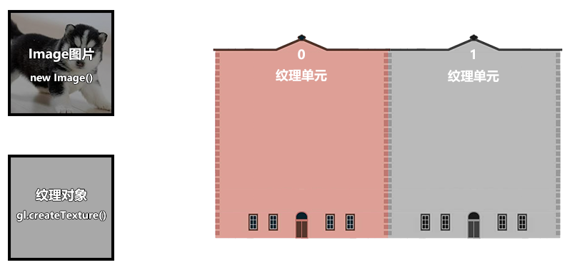
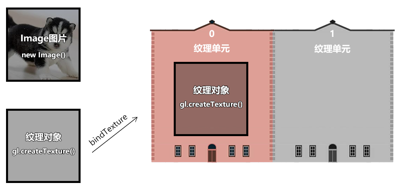
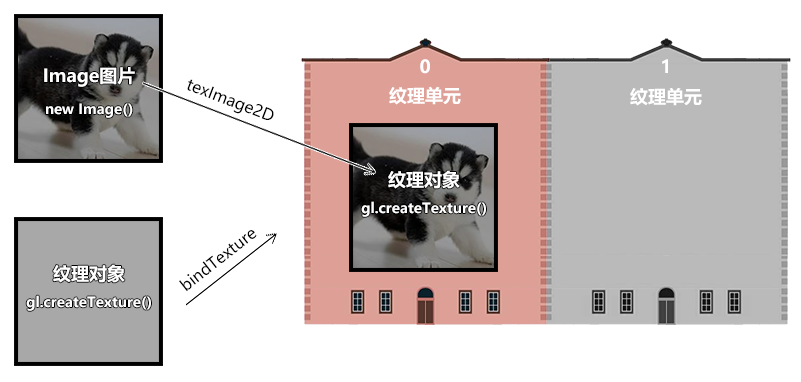

## 纹理

纹理，通常指的就是二维的栅格图像，我们可以将其作为 webgl 图形的贴图。

而在 webgl 里，还有一个纹理对象的概念，它是对图像又做了一层封装，这个我们后面会详解。

接下来，我们要先建立几个基础概念，以便于理解 webgl 的贴图流程。

### 1-基础概念

#### 1-1-栅格系统

我们在说图像的时候，往往都是指点阵图、栅格图、位图。

而与其相对应的是图形，也叫做矢量图。

我接下来说的纹理，就是属于图像，其图像的建立和显示会遵循栅格系统里的规范。

比如，所有图像都是由像素组成的，在 webgl 里我们把像素称为片元，像素是按照相互垂直的行列排列的。

如下图：


将其放大后就可以看见其中的栅格：


图像中的每个像素都可以通过行数 y 和列数 x 来找到，由(x,y) 构成的点位，就是图像的像素坐标。

因为 canvas 画布也是一张图像，所以图像的栅格坐标系和我们之前说过的 canvas2d 的坐标系是一样的，我们可以简单回顾一下：


栅格坐标系的原点在左上角。

栅格坐标系的 y 轴方向是朝下的。

栅格坐标系的坐标基底由两个分量组成，分别是一个像素的宽和一个像素的高。

#### 1-2-图钉

图钉是我自己写的概念，源自于 photoshop 中图像的操控变形功能，这种称呼很形象。


webgl 中，图钉的位置是通过 uv 坐标来控制的，图钉的 uv 坐标和顶点的 webgl 坐标是两种不同的坐标系统，之后我们会其相互映射，从而将图像特定的一块区域贴到 webgl 图形中。

比如我将其映射到下面的蓝色三角形中：


注：我们在 webgl 里打图钉的时候不会发生边界线的扭曲，上图重在示意。

#### 1-3-uv 坐标系

我们在 webgl 里打图钉的时候，要考虑图钉在图像中的定位。

说到定位，大家不要先想位置，而是要先想坐标系，咱们接下来说一下图钉使用的 uv 坐标系。


uv 坐标系，也叫 st 坐标系，大家以后见到了知道是一回事即可。

uv 坐标系的坐标原点在图像的左下角，u 轴在右，v 轴在上。

u 轴上的 1 个单位是图像的宽；

v 轴上的一个单位是图像的高。

#### 1-4-采样器

采样器是按照图钉位置从图像中获取片元的方式。

我们在图像中所打的图钉位置，并不是图像中某一个片元的位置，因为片元位置走的是栅格坐标系。

所以我们需要一个采样器去对图钉的 uv 坐标系和像素的栅格坐标系做映射，从而去采集图像中图钉所对应的片元。

着色器基于一张图像可以建立一个，或多个采样器，不同的采样器可以定义不同的规则去获取图像中的片元。

采样器在着色器中是一种变量类型，写做 sampler2D，它就像我们之前写过的 vec4 类型一样，可以在片元着色器中通过 uniform 变量暴露给 js，让 js 对其进行修改。

既然 js 可以对采样器进行修改了，那 js 必然会以某种方式向着色器传递其建立采样器所需的数据。

接下来咱们就先说一下这种的数据。

#### 1-5-纹理对象

着色器使用一个纹理对象，就可以建立一个采样器。

纹理对象的建立需要一个图像源，比如 Image 对象。

同是，我们还需要设置纹理对象和图钉进行数据映射的方式。

纹理对象是通过 js 来建立的，js 并不能直接将纹理对象传递给着色器。因为纹理对象说的是 js 语言，说 glsl es 语言的着色器是不认识这种语言的。

所以，webgl 在浏览器底层为纹理对象建立了一块缓冲区，缓存区可以理解为用于存放纹理对象的磁盘空间，这块空间可以将纹理对象翻译成着色器可以读懂的数据。

之后我们会把这个空间的索引位置传给着色器，让着色器基于这个空间的索引位置，找到这个空间，然后再从空间中找到纹理对象，最后通过纹理对象建立采样器。

接下来咱们就说一下这个用于存储纹理对象的空间-纹理单元。

#### 1-6-纹理单元

纹理单元是一种专门用来存放纹理对象的缓冲区，就像我们之前用 createBuffer()方法建立的用于存储数据源的缓冲区一样。

纹理单元是由 webgl 提前建立好的，只有固定的几个，如 TEXTURE0|1|2|3|4|5|6|7|8，这就像我们实际中住的楼房单元一样，已经被 webgl 提前在浏览器中建立起来了，数量有限。

纹理单元虽然无需我们自己建立，但需要我们自己激活，让其进入使用状态。

基本概念咱们就说到这，接下来咱们看一下整体的代码实现。

如 ./code/6.纹理贴图 1.html

### 2-整体代码

1.顶点着色器

```html
<script id="vertexShader" type="x-shader/x-vertex">
  attribute vec4 a_Position;
  attribute vec2 a_Pin;
  varying vec2 v_Pin;
  void main(){
    gl_Position = a_Position;
    v_Pin=a_Pin;
  }
</script>
```

- a_Pin 图钉位置

  2.片元着色器

```html
<script id="fragmentShader" type="x-shader/x-fragment">
  precision mediump float;
  uniform sampler2D u_Sampler;
  varying vec2 v_Pin;
  void main(){
    gl_FragColor=texture2D(u_Sampler,v_Pin);
  }
</script>
```

- sampler2D 是 uniform 变量的类型，叫做二维取样器
- texture2D() 基于图钉从取样器中获取片元颜色

  3.初始化着色器

```js
const canvas = document.getElementById("canvas");
canvas.width = window.innerWidth;
canvas.height = window.innerHeight;
const gl = canvas.getContext("webgl");

const vsSource = document.getElementById("vertexShader").innerText;
const fsSource = document.getElementById("fragmentShader").innerText;
initShaders(gl, vsSource, fsSource);
gl.clearColor(0.0, 0.0, 0.0, 1.0);
```

4.建立数据源，并计算相应尺寸

```js
//数据源
const source = new Float32Array([
  -0.5, 0.5, 0.0, 1.0, -0.5, -0.5, 0.0, 0.0, 0.5, 0.5, 1.0, 1.0, 0.5, -0.5, 1.0,
  0.0,
]);
const FSIZE = source.BYTES_PER_ELEMENT;
//元素字节数
const elementBytes = source.BYTES_PER_ELEMENT;
//系列尺寸
const posSize = 2;
const PinSize = 2;
//类目尺寸
const categorySize = posSize + PinSize;
//类目字节数
const categoryBytes = categorySize * elementBytes;
//系列字节索引位置
const posByteIndex = 0;
const pinByteIndex = posSize * elementBytes;
//顶点总数
const sourceSize = source.length / categorySize;
```

数据源中有两个系列，分别是顶点位置系列和图钉位置系列。

5.将数据源写入到缓冲区，让 attribute 变量从其中寻找数据。

```js
const sourceBuffer = gl.createBuffer();
gl.bindBuffer(gl.ARRAY_BUFFER, sourceBuffer);
gl.bufferData(gl.ARRAY_BUFFER, source, gl.STATIC_DRAW);

const a_Position = gl.getAttribLocation(gl.program, "a_Position");
gl.vertexAttribPointer(
  a_Position,
  posSize,
  gl.FLOAT,
  false,
  categoryBytes,
  posByteIndex
);
gl.enableVertexAttribArray(a_Position);

const a_Pin = gl.getAttribLocation(gl.program, "a_Pin");
gl.vertexAttribPointer(
  a_Pin,
  pinSize,
  gl.FLOAT,
  false,
  categoryBytes,
  pinByteIndex
);
gl.enableVertexAttribArray(a_Pin);
```

6.建立 Image 图像作为图像源，当图像源加载成功后再贴图。

```js
//对纹理图像垂直翻转
gl.pixelStorei(gl.UNPACK_FLIP_Y_WEBGL, 1);

//纹理单元
gl.activeTexture(gl.TEXTURE0);

//纹理对象
const texture = gl.createTexture();
//把纹理对象装进纹理单元里
gl.bindTexture(gl.TEXTURE_2D, texture);

//image 对象
const image = new Image();
image.src = "./images/erha2.jpg";
image.onload = function () {
  showMap();
};

//贴图
function showMap() {
  //配置纹理图像
  gl.texImage2D(gl.TEXTURE_2D, 0, gl.RGB, gl.RGB, gl.UNSIGNED_BYTE, image);

  //配置纹理参数
  gl.texParameteri(gl.TEXTURE_2D, gl.TEXTURE_MIN_FILTER, gl.LINEAR);

  //获取u_Sampler
  const u_Sampler = gl.getUniformLocation(gl.program, "u_Sampler");
  //将0号纹理分配给着色器，0 是纹理单元编号
  gl.uniform1i(u_Sampler, 0);

  //渲染
  render();
}

function render() {
  gl.clear(gl.COLOR_BUFFER_BIT);
  gl.drawArrays(gl.TRIANGLE_STRIP, 0, sourceSize);
}
```

接下来咱们重点解释上面的这部分代码。

### 贴图详解

1.准备三个角色

- Image 图像
- 纹理对象
- 纹理单元



```js
//纹理单元
gl.activeTexture(gl.TEXTURE0);

//纹理对象
const texture = gl.createTexture();

//image 对象
const image = new Image();
image.src = "./images/erha.jpg";
```

- activeTexture(gl.TEXTURE0) 激活 0 号单元
- createTexture() 创建纹理对象

  2.把纹理对象装进当前已被激活的纹理单元里



```js
const texture = gl.createTexture();
gl.bindTexture(gl.TEXTURE_2D, texture);
```

- TEXTURE_2D 纹理对象的类型

  3.当 Image 图像加载成功后，把图像装进当前纹理单元的纹理对象里。



```js
gl.texImage2D(gl.TEXTURE_2D, 0, gl.RGB, gl.RGB, gl.UNSIGNED_BYTE, image);
```

texImage2D(type, level, internalformat, format, type, pixels)

- type 纹理类型
- level 基本图像等级
- internalformat 纹理中的颜色组件
- format 纹理数据格式，必须和 internalformat 一样
- type 纹理数据的数据类型
  - UNSIGNED_BYTE 无符号字节
- pixels 图像源

  4.纹理对象还有一些相应参数需要设置一下

```js
gl.texParameteri(gl.TEXTURE_2D, gl.TEXTURE_MIN_FILTER, gl.LINEAR);
```

texParameteri(type, pname, param)

- type 纹理类型
  - TEXTURE_2D 二维纹理
- pname 纹理参数的名称
  - TEXTURE_MIN_FILTER 纹理缩小滤波器
- param 与 pname 相对应的纹理参数值

  - gl.LINEAR 线性

    5.在 js 中获取采样器对应的 Uniform 变量,告诉片元着色器中的采样器，纹理对象在哪个单元里。之后采样器便会根据单元号去单元对象中寻找纹理对象。


```js
const u_Sampler = gl.getUniformLocation(gl.program, "u_Sampler");
gl.uniform1i(u_Sampler, 0);
```

6.渲染

```js
render();
function render() {
  gl.clear(gl.COLOR_BUFFER_BIT);
  gl.drawArrays(gl.TRIANGLE_STRIP, 0, sourceSize);
}
```

效果如下：


这时候的图像是倒立的，这是由于 Image 对象遵守的是栅格坐标系，栅格坐标系的 y 轴朝下，而 uv 坐标系的 y 朝上，两者相反，所以画出的图形反了。

7.对图像进行预处理，将图像垂直翻转

```js
gl.pixelStorei(gl.UNPACK_FLIP_Y_WEBGL, 1);
```

pixelStorei(pname, param) 图像预处理

- pname 参数名
  - gl.UNPACK_FLIP_Y_WEBGL 是否垂直翻，布尔值，1|0
- param 参数值


关于纹理贴图的基本流程和思路就是这样，接下来我们还要对其中的几个知识点进行详细讲解，不然以后遇到问题了会找不到解决方案。

### 纹理容器

我们之前在贴图的时候，默认图像源的尺寸只能是 2 的 n 次方，比如 2、4、8、16、……、256、512 等。

如果我们把图像的尺寸改成非 2 次幂尺寸，如 300\*300，那贴图就无法显示。

我们要想解决这种问题，就得设置一下纹理的容器。

我们在图像上打图钉的时候，形成一块 uv 区域，这块区域可以理解为纹理容器。

纹理容器可以定义图钉区域的纹理如何显示在 webgl 图形中。

通过对纹理容器的设置，我们可以实现以下功能：

- 非二次幂图像源的显示
- 纹理的复制
- 纹理的镜像

#### 1-非二次幂图像源的显示

```js
gl.texParameteri(gl.TEXTURE_2D, gl.TEXTURE_WRAP_S, gl.CLAMP_TO_EDGE);
gl.texParameteri(gl.TEXTURE_2D, gl.TEXTURE_WRAP_T, gl.CLAMP_TO_EDGE);
```

TEXTURE_WRAP_S 和 TEXTURE_WRAP_T 就是纹理容器在 s 方向和 t 方向的尺寸，这里的 s、t 就是 st 坐标系里的 s、t，st 坐标系和 uv 坐标系是一回事。

CLAMP_TO_EDGE 翻译过来就是边缘夹紧的意思，可以理解为任意尺寸的图像源都可以被宽高为 1 的 uv 尺寸夹紧。

注：只有 CLAMP_TO_EDGE 才能实现非二次幂图像源的显示，其它的参数都不可以。

#### 2-纹理的复制

uv 坐标系的坐标基底分别是 1 个图片的宽度金额 1 个图片的高度，可是如果我们将 2 个图片的宽高映射到了图形上会是什么结果呢?

默认是下面这样的的


这是由纹理容器的默认值决定的：

```js
gl.texParameteri(
  gl.TEXTURE_2D,
  gl.TEXTURE_WRAP_S,
  gl.REPEAT // REPEAT 就是纹理重复的意思。
);
gl.texParameteri(
  gl.TEXTURE_2D,
  gl.TEXTURE_WRAP_T,
  gl.REPEAT // REPEAT 就是纹理重复的意思。
);
```

### 3-纹理的镜像复制

纹理的镜像复制可以实现纹理的水平、垂直翻转和复制

效果如下


代码如下：

```js
gl.texParameteri(gl.TEXTURE_2D, gl.TEXTURE_WRAP_S, gl.MIRRORED_REPEAT);
gl.texParameteri(gl.TEXTURE_2D, gl.TEXTURE_WRAP_T, gl.MIRRORED_REPEAT);
```

MIRRORED_REPEAT 就是镜像复制的意思。

我们也可以通过使用 CLAMP_TO_EDGE 只对某一个方向纹理镜像复制。

```js
gl.texParameteri(gl.TEXTURE_2D, gl.TEXTURE_WRAP_S, gl.MIRRORED_REPEAT);
gl.texParameteri(gl.TEXTURE_2D, gl.TEXTURE_WRAP_T, gl.CLAMP_TO_EDGE);
```

### 分子贴图

分子贴图 mipmap 是一种纹理映射技术。

比如：

webgl 中有一个正方形，它在 canvas 画布中显示的时候，占据了 2\*2 个像素，我们要将一个 8\*8 的图像源贴上去。

正方形中肯定不能显示图像源中的所有像素，因为它只有 2\*2=4 个像素。

在 Photoshop 中，会将图像源切割成 2 行、2 列的色块，然后将每个色块的均值交个正方形。

在 webgl 中也有类似的方法，并且它还有一层渲染性能的优化（Photoshop 底层是否有这层优化我尚且不知）。

接下来咱们就说一下这层优化优化的是什么。

先想象一个场景，我要把 1024\*1024 的图像源映射到 canvas 画布上 2\*2 的正方形中，若把图像源分割求均值会产生庞大的数据运算，我们需要想办法把和正方形相映射的图像源的尺寸降到最小，比如就是 2\*2 的。

因此，我们就需要[分子贴图](https://baike.baidu.com/item/Mipmap/3722136?fr=aladdin)了。

分子贴图是一个基于分辨率等比排列的图像集合，集合中每一项的宽高与其前一项宽高的比值都是 1/2。

如下图：


在 webgl 中，我们可以使用 gl.generateMipmap() 方法为图像源创建分子贴图，

有了分子贴图后，之前 2\*2 的正方形便会从分子集合中寻找与其分辨率最接近的分子图像。

在找到分子图像后，就需要基于 webgl 图形的片元尺寸对其分割取色了。

对于取色的方法，咱们之前说一个均值算法，其实还有其它算法。

我们看一下 webgl 给提供的方法。

```js
//创建分子贴图
gl.generateMipmap(gl.TEXTURE_2D);
//定义从分子图像中取色的方法
gl.texParameteri(gl.TEXTURE_2D, gl.TEXTURE_MAG_FILTER, gl.LINEAR);
gl.texParameteri(gl.TEXTURE_2D, gl.TEXTURE_MIN_FILTER, gl.LINEAR);
```

gl.texParameteri()方法中的第 2 个参数和第 3 个参数是键值对的关系。

TEXTURE_MAG_FILTER 和 TEXTURE_MIN_FILTER，对应的是纹理在 webgl 图形中的缩放情况。

- TEXTURE_MAG_FILTER 纹理放大滤波器，是纹理在 webgl 图形中被放大的情况。
- TEXTURE_MIN_FILTER 纹理缩小滤波器，是纹理在 webgl 图形中被缩小的情况。

TEXTURE_MAG_FILTER 具备以下参数：

- LINEAR (默认值) ，线性滤镜， 获取纹理坐标点附近 4 个像素的加权平均值，效果平滑
- NEAREST 最近滤镜， 获得最靠近纹理坐标点的像素 ，效果锐利

TEXTURE_MIN_FILTER 具备以下参数：

- LINEAR 线性滤镜，获取纹理坐标点附近 4 个像素的加权平均值，效果平滑
- NEAREST 最近滤镜， 获得最靠近纹理坐标点的像素，效果锐利
- NEAREST_MIPMAP_NEAREST Select the nearest mip level and perform nearest neighbor filtering .
- NEAREST_MIPMAP_LINEAR (默认值) Perform a linear interpolation between mip levels and perform nearest neighbor filtering within each .
- LINEAR_MIPMAP_NEAREST Select the nearest mip level and perform linear filtering within it .
- LINEAR_MIPMAP_LINEAR Perform a linear interpolation between mip levels and perform linear filtering : also called trilinear filtering .

注：后面这 4 个与分子贴图相关的参数适合比较大的贴图，若是比较小的贴图，使用 LINEAR 或 NEAREST 就好。

注：缩小滤波器的默认值取色方法是 NEAREST_MIPMAP_LINEAR ，这个方法会从分子贴图里找分子图像，然后从其中取色，然而当我们没有使用 gl.generateMipmap()方法建立分子贴图的时候，就得给它一个不需要从分子贴图中去色的方法，如 LINEAR 或 NEAREST。

### 多纹理模型

在实际开发中，经常会遇到一个模型，多个纹理的情况。

比如这个魔方:


这样我们只需要加载一次图片，建立一个纹理对象，做一次纹理和顶点数据的映射就可以了。

这里面没有涉及任何新的知识点，但这是一种很重要的项目开发经验。
