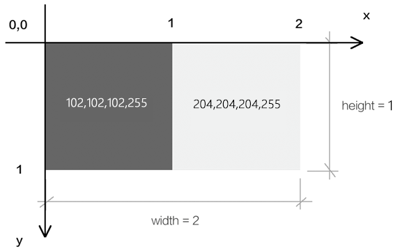

## 纹理

纹理，通常指的就是二维的栅格图像，我们可以将其作为 webgl 图形的贴图。

而在 webgl 里，还有一个纹理对象的概念，它是对图像又做了一层封装，这个我们后面会详解。

接下来，我们要先建立几个基础概念，以便于理解 webgl 的贴图流程。

### 1-基础概念

#### 1-1-栅格系统

我们在说图像的时候，往往都是指点阵图、栅格图、位图。

而与其相对应的是图形，也叫做矢量图。

我接下来说的纹理，就是属于图像，其图像的建立和显示会遵循栅格系统里的规范。

比如，所有图像都是由像素组成的，在 webgl 里我们把像素称为片元，像素是按照相互垂直的行列排列的。

如下图：

将其放大后就可以看见其中的栅格：

图像中的每个像素都可以通过行数 y 和列数 x 来找到，由(x,y) 构成的点位，就是图像的像素坐标。

因为 canvas 画布也是一张图像，所以图像的栅格坐标系和我们之前说过的 canvas2d 的坐标系是一样的，我们可以简单回顾一下：

栅格坐标系的原点在左上角。

栅格坐标系的 y 轴方向是朝下的。

栅格坐标系的坐标基底由两个分量组成，分别是一个像素的宽和一个像素的高。

#### 1-2-图钉

图钉是我自己写的概念，源自于 photoshop 中图像的操控变形功能，这种称呼很形象。

webgl 中，图钉的位置是通过 uv 坐标来控制的，图钉的 uv 坐标和顶点的 webgl 坐标是两种不同的坐标系统，之后我们会其相互映射，从而将图像特定的一块区域贴到 webgl 图形中。

比如我将其映射到下面的蓝色三角形中：

注：我们在 webgl 里打图钉的时候不会发生边界线的扭曲，上图重在示意。

#### 1-3-uv 坐标系

我们在 webgl 里打图钉的时候，要考虑图钉在图像中的定位。

说到定位，大家不要先想位置，而是要先想坐标系，咱们接下来说一下图钉使用的 uv 坐标系。

uv 坐标系，也叫 st 坐标系，大家以后见到了知道是一回事即可。

uv 坐标系的坐标原点在图像的左下角，u 轴在右，v 轴在上。

u 轴上的 1 个单位是图像的宽；

v 轴上的一个单位是图像的高。

#### 1-4-采样器

采样器是按照图钉位置从图像中获取片元的方式。

我们在图像中所打的图钉位置，并不是图像中某一个片元的位置，因为片元位置走的是栅格坐标系。

所以我们需要一个采样器去对图钉的 uv 坐标系和像素的栅格坐标系做映射，从而去采集图像中图钉所对应的片元。

着色器基于一张图像可以建立一个，或多个采样器，不同的采样器可以定义不同的规则去获取图像中的片元。

采样器在着色器中是一种变量类型，写做 sampler2D，它就像我们之前写过的 vec4 类型一样，可以在片元着色器中通过 uniform 变量暴露给 js，让 js 对其进行修改。

既然 js 可以对采样器进行修改了，那 js 必然会以某种方式向着色器传递其建立采样器所需的数据。

接下来咱们就先说一下这种的数据。

#### 1-5-纹理对象

着色器使用一个纹理对象，就可以建立一个采样器。

纹理对象的建立需要一个图像源，比如 Image 对象。

同是，我们还需要设置纹理对象和图钉进行数据映射的方式。

纹理对象是通过 js 来建立的，js 并不能直接将纹理对象传递给着色器。因为纹理对象说的是 js 语言，说 glsl es 语言的着色器是不认识这种语言的。

所以，webgl 在浏览器底层为纹理对象建立了一块缓冲区，缓存区可以理解为用于存放纹理对象的磁盘空间，这块空间可以将纹理对象翻译成着色器可以读懂的数据。

之后我们会把这个空间的索引位置传给着色器，让着色器基于这个空间的索引位置，找到这个空间，然后再从空间中找到纹理对象，最后通过纹理对象建立采样器。

接下来咱们就说一下这个用于存储纹理对象的空间-纹理单元。

#### 1-6-纹理单元

纹理单元是一种专门用来存放纹理对象的缓冲区，就像我们之前用 createBuffer()方法建立的用于存储数据源的缓冲区一样。

纹理单元是由 webgl 提前建立好的，只有固定的几个，如 TEXTURE0|1|2|3|4|5|6|7|8，这就像我们实际中住的楼房单元一样，已经被 webgl 提前在浏览器中建立起来了，数量有限。

纹理单元虽然无需我们自己建立，但需要我们自己激活，让其进入使用状态。

基本概念咱们就说到这，接下来咱们看一下整体的代码实现。
